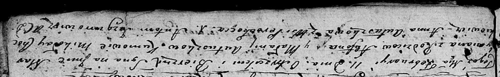

**Автушко Стефан (Autuszko Stefan)**

11 февраля 1806 г -- крещение сына Мартымьяна (НИАБ 136-13-894, лист 59,
№6/1806-р (ориг)).

**НИАБ 136-13-894:** Лист 59. **Метрическая запись №6/1806-р (ориг).**

Дедиловичская Покровская церковь. 11 февраля 1806 года. Метрическая
запись о крещении.

Autuszko Martymjan -- сын родителей с деревни Переходцы.

Autuszko Stefan -- отец.

Autuszkowa Malanija -- мать.

Chockiewicz Mikołay -- кум.

Autuszkowa Anna -- кума.

Jazgunowicz Antoni -- ксёндз.
