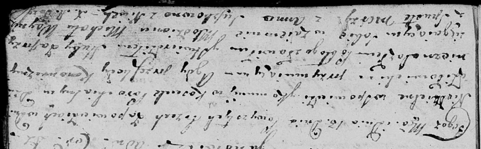

**Войнич (Сушко) Анна (Woyniczowa (Suszkowa) Anna)**

13 ноября 1807 г -- венчание с молодым Михалом Войничем с деревни
Пустомстиж (НИАБ 136-13-920, лист 13, №12/1807-б (ориг)).

**НИАБ 136-13-920:** Лист 13. **Метрическая запись №12/1807-б (ориг).**

Дедиловичская Покровская церковь. 13 ноября 1807 года. Метрическая
запись о венчании.

Woynicz Michał -- жених,молодой, деревня Пустомстиж.

Suszkowna Anna -- невеста, с деревни Нивки.

Jazgunowicz Antoni -- ксёндз.
