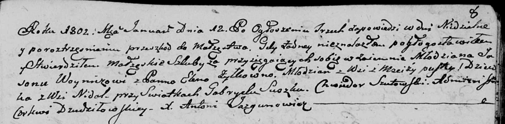

**Войнич (Жилко) Елена (Woyniczowa Elena z Żyłkow)**

12 января 1802 г -- венчание с молодым Ясоном Войничем с деревни
Пустомстиж (НИАБ 136-13-920, лист 8, №1/1802-б (ориг)).

**НИАБ 136-13-920:** Лист 8. **Метрическая запись №1/1802-б (ориг).**

{width="6.496527777777778in"
height="1.5998261154855644in"}

Дедиловичская Покровская церковь. 12 января 1802 года. Метрическая
запись о венчании.

Woynicz Jason -- жених, молодой, с деревни Пустомстиж.

Żyłkowna Elena -- невеста, девка, с деревни Недаль.

Suszko Gabryel -- свидетель.

Szutowski Chwiedor -- свидетель.

Jazgunowicz Antoni -- ксёндз.
