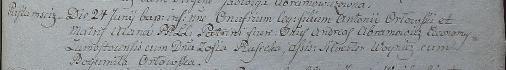

**Орловский Антоний (Orłowski Antoni)**

5 ноября 1794 г -- свидетель при венчании Хведора Барадульского с
деревни Иканы Кимейской парафии и Зыновии Сушко с деревни Недаль (НИАБ
136-13-920, лист 1об, №10/1794-б (ориг)).

27 июня 1798 г -- крещение сына Онуфрия (НИАБ 1781-27-199, лист 122,
№7/1798-р).

**НИАБ 136-13-920:** Лист 1об. **Метрическая запись №10/1794-б (ориг).**

Дедиловичская Покровская церковь. 5 ноября 1794 года. Метрическая запись
о венчании.

Baradulski Chwiedor -- жених, деревня \[Иканы\], парафия Кимейская.

Suszkowna Zynowia -- невеста, девка, деревня Нидаль.

Orłowski Antoni -- свидетель, деревня Пустомстиж.

Szkurat Jan -- свидетель.

Jazgunowicz Antoni -- ксёндз.

**НИАБ 1781-27-199:** Лист 122. **Метрическая запись №7/1798-р.**

Дедиловичский костел Наисвятейшего Сердца Иисуса. 27 июня 1798 года.
Метрическая запись о крещении.

Orłowski Onufri -- сын крестьян с деревни Пустомстиж.

Orłowski Antoni -- отец.

Orłowska Ulana -- мать.

Abramowicz Andreas -- крестный отец, эконом Замосточский.

Piasecka Zofia - крестная мать.

Woynicz Silwester -- ассистент.

Orłowska Bogumiła -- ассистентка.

Linhart Hyacinthus -- ксёндз.
