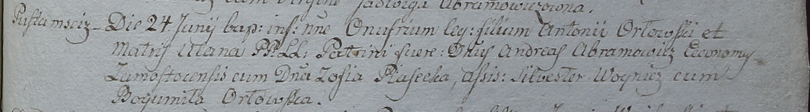

**Орловский Онуфрий Антониев (Orłowski Onufri)**

27 июня 1798 г -- крещение сына Онуфрия (НИАБ 1781-27-199, лист 122,
№7/1798-р).

**НИАБ 1781-27-199:** Лист 122. **Метрическая запись №7/1798-р.**

Дедиловичский костел Наисвятейшего Сердца Иисуса. 27 июня 1798 года.
Метрическая запись о крещении.

Orłowski Onufri -- сын крестьян с деревни Пустомстиж.

Orłowski Antoni -- отец.

Orłowska Ulana -- мать.

Abramowicz Andreas -- крестный отец, эконом Замосточский.

Piasecka Zofia - крестная мать.

Woynicz Silwester -- ассистент.

Orłowska Bogumiła -- ассистентка.

Linhart Hyacinthus -- ксёндз.
