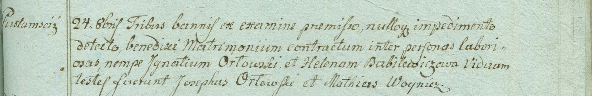

**Орловский Игнаты (Orłowski Jgnaty)**

24 октября 1798 г -- венчание с крестьянкой Еленой Бабилевич (НИАБ
1781-27-199, лист 124, №1/1798-б).

**НИАБ 1781-27-199:** Лист 124. **Метрическая запись №1/1798-б.**

{width="6.496527777777778in"
height="1.0555555555555556in"}

Дедиловичский костел Наисвятейшего Сердца Иисуса. 24 октября 1798 года.
Метрическая запись о венчании.

Orłowski Jgnaty -- жених, крестьянин, с деревни Пустомстиж.

Babilewiczowa Helena -- невеста, крестьянка.

Orłowski Joseph -- свидетель.

Woynicz Matheus -- свидетель.

Linhart Hyacinthus -- ксёндз.
