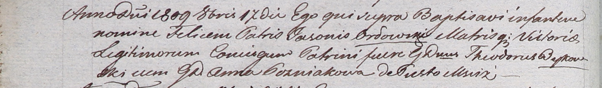

**Орловский Феликс Ясонов (Orłowski Felix)**

17 октября 1809 г -- крещение сына Феликса (НИАБ 937-4-32, лист 29,
№29/1809-р).

**НИАБ 937-4-32:** Лист 20об. **Метрическая запись №29/1809-р.**

Дедиловичский костел Наисвятейшего Сердца Иисуса. 17 октября 1809 года.
Метрическая запись о крещении.

Orłowski Felix -- сын шляхтичей с деревни Пустомстиж.

Orłowski Jason -- отец.

Orłowska Victoria -- мать.

Bykowski Theodor -- крестный отец, шляхтич.

Gozniakowa Anna -- крестная мать, шляхтянка.

Miszkun Marcus -- ксёндз, комендант Дедиловичский.
