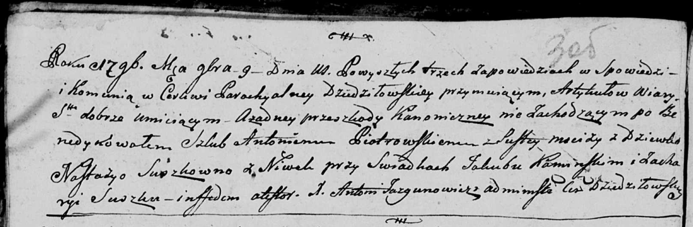

**Петровский Антоний (Piotrowski Antoni)**

9 ноября 1796 г -- венчание с девкой Настасьей Сушко с деревни Нивки
(НИАБ 136-13-920, лист 3об, №12/1796-б (ориг)).

**НИАБ 136-13-920:** Лист 3об. **Метрическая запись №12/1796-б (ориг).**

{width="6.496527777777778in"
height="2.133548775153106in"}

Дедиловичская Покровская церковь. 9 ноября 1796 года. Метрическая запись
о венчании.

Piоtrowski Antoni -- жених, деревня Пустомстиж.

Suszkowna Nastazya -- невеста, девка, деревня Нивки.

Kaminski Jakub -- свидетель.

Suszko Zachary -- свидетель.

Jazgunowicz Antoni -- ксёндз.
