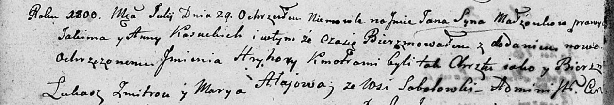
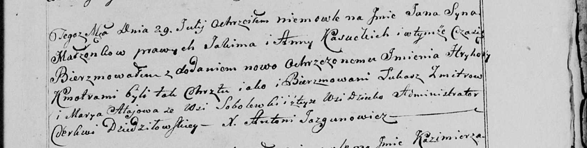

**Алай Марыя (Alay Marya)**

29 июля 1800 г -- крестная мать Яна Григория, сына Касуцких Якима и Анны
(НИАБ 136-13-894, лист 41об, №20/1800-р (ориг), НИАБ 136-13-949, лист
103, №22/1800-р (коп)).

**НИАБ 136-13-894:** Лист 41об. **Метрическая запись №20/1800-р
(ориг).**

Дедиловичская Покровская церковь. 29 июля 1800 года. Метрическая запись
о крещении.

Kasucki Jan Hryhory -- сын.

Kasucki Jakim -- отец.

Kasucka Anna -- мать.

Zmitrok Łukasz -- кум.

Ałajowa Marya -- кума, с деревни Соболевка.

Jazgunowicz Antoni -- ксёндз.

**НИАБ 136-13-949:** Лист 103. **Метрическая запись №22/1800-р (коп).**

(См. тж.: РГИА 823-2-18, лист 276об, №19/1800-р (коп), НИАБ 136-13-894,
лист 41об, №20/1800-р (ориг))

Дедиловичская Покровская церковь. 29 июля 1800 года. Метрическая запись
о крещении.

Kasucki Jan Hryhorу -- сын родителей с деревни Соболевка \[Нивки\].

Kasucki Jakim -- отец.

Kasucka Anna -- мать.

Zmitrow Łukasz -- кум.

Ałajowa Marya - кума, с деревни Соболевка.

Jazgunowicz Antoni -- ксёндз.
