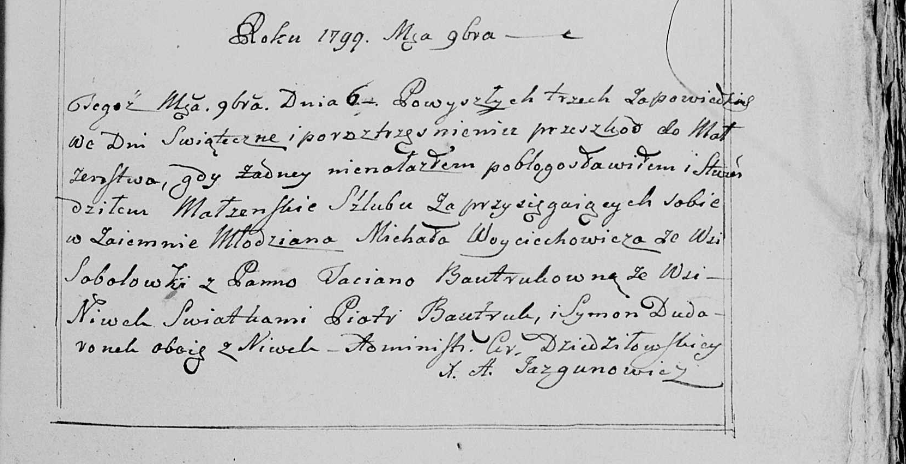

**Войцеховский Михал (Woyciechowski Michał)**

6 ноября 1799 г -- венчание с Татьяной Бавтрук с деревни Нивки (НИАБ
136-13-920, лист 6об, №4/1799-б (ориг), НИАБ 136-13-938, лист 248,
№4/1799-б (коп)).

**НИАБ 136-13-920:** Лист 6об. **Метрическая запись №4/1799-б (ориг).**

{width="6.496527777777778in"
height="1.0909120734908135in"}

Дедиловичская Покровская церковь. 6 ноября 1799 года. Метрическая запись
о венчании.

Woyciechowski Michał -- жених, деревня Соболевка.

Bautrukowna Taciana -- невеста, деревня Нивки.

Bautruk Piotr -- свидетель, деревня Нивки.

Dudaronek Simon -- свидетель, деревня Нивки.

Jazgunowicz Antoni -- ксёндз.

**НИАБ 136-13-938:** Лист 248. **Метрическая запись №4/1799-б (коп).**

(См. тж. НИАБ 136-13-920, лист 6об, №4/1799-б (ориг))

{width="6.496527777777778in"
height="3.3270833333333334in"}

Дедиловичская Покровская церковь. 6 ноября 1799 года. Метрическая запись
о венчании.

Woyciechowicz Michał -- жених, молодой, с деревни Соболевка.

Bautrukowna Taciana -- невеста, с деревни Нивки.

Bautruk Piotr -- свидетель, с деревни Нивки.

Dudaronek Symon -- свидетель, с деревни Нивки.

Jazgunowicz Antoni -- ксёндз.
