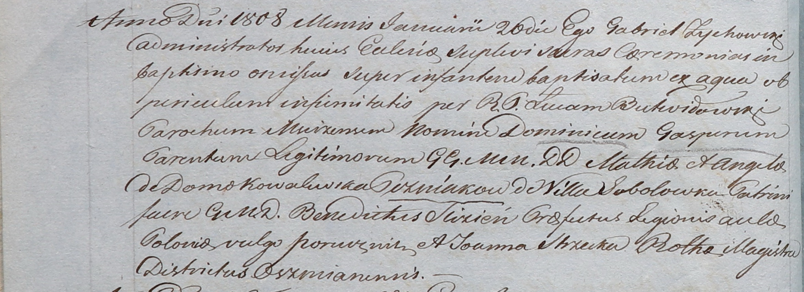

**Гозняк (Ковалевская) Ангеля (Gozniakowa Angela z Kowalewskich)**

12 ноября 1806 г -- крещение сына Иосифа (НИАБ 937-4-32, лист 14,
№22/1806-р).

20 января 1808 г -- крещение сына Доминика (НИАБ 937-4-32, лист 17об,
№3/1808-р).

1 января 1812 г -- крещение сына Доминика Гаспера (НИАБ 937-4-32, лист
17об, №3/1808-р).

**НИАБ 937-4-32:** Лист 14. **Метрическая запись №22/1806-р.**

{width="6.496527777777778in"
height="1.9520833333333334in"}

Дедиловичский костел Наисвятейшего Сердца Иисуса. 12 ноября 1806 года.
Метрическая запись о крещении.

Gozniak Joseph -- сын шляхтичей с деревни Соболевка.

Gozniak Matheas -- отец.

Gozniakowa Angela z Kowalewskich -- мать.

Strzecki Antoni -- крестный отец, шляхтич.

Buiewiczowa Hedwiga -- крестная мать, шляхтянка.

Stankiewicz Romualdus - ассистент, шляхтич.

Kiszkiewiczowa Brigita - ассистентка, шляхтянка.

Skindzelewski Andreas -- ксёндз, куратор Дедиловичский.

**НИАБ 937-4-32:** Лист 17об. **Метрическая запись №3/1808-р.**

{width="6.496527777777778in"
height="2.3694444444444445in"}

Дедиловичский костел Наисвятейшего Сердца Иисуса. 20 января 1808 года.
Метрическая запись о крещении.

Gozniak Dominic Gasper -- сын шляхтичей с деревни Соболевка.

Gozniak Mathias -- отец.

Gozniakowa Angela z Kowalewskich -- мать.

Slizien Benedict -- крестный отец, шляхтич.

Szecka Joanna -- крестная мать, шляхтянка, ротмистрша Ошмянская.

Zychowski Gabriel -- ксёндз.

Butwiłowski Łucas - ксёндз, администратор Мстижский.
