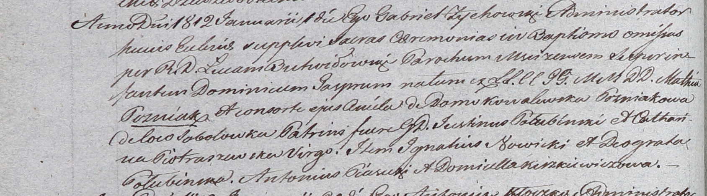

**Гозняк Доминик Матеев младший (Gozniak Dominic Gasper)**

1 января 1812 г -- крещение (НИАБ 937-4-32, лист 17об, №3/1808-р).

**НИАБ 937-4-32:** Лист 24об. **Метрическая запись №9/1812-р.**

Дедиловичский костел Наисвятейшего Сердца Иисуса. 1 января 1812 года.
Метрическая запись о крещении.

Gozniak Dominic Gasper -- сын шляхтичей с деревни Соболевка.

Gozniak Mathias -- отец.

Gozniakowa Aniela z Kowalewskich -- мать.

Połubinski Justin -- крестный отец, шляхтич.

Piotraszewska Catharina -- крестная мать, шляхтянка, девица.

Nowicki Jgnatius - ассистент, шляхтич.

Połubinska Deograta - ассистентка, шляхтянка.

Piasecki Antonius - ассистент, шляхтич.

Kirzkiewiczowa Domicella - ассистентка, шляхтянка.

Zychowski Gabriel -- ксёндз.

Butwiłowski Łucas -- ксендз, администратор Мстижский.
