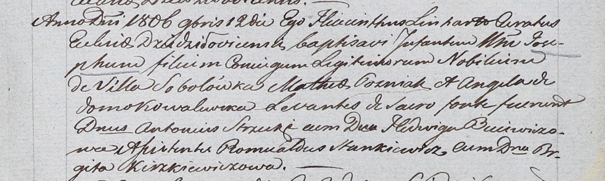

**Гозняк Иосиф Матеев (Gozniak Joseph)**

12 ноября 1806 г -- крещение (НИАБ 937-4-32, лист 14, №22/1806-р).

**НИАБ 937-4-32:** Лист 14. **Метрическая запись №22/1806-р.**

Дедиловичский костел Наисвятейшего Сердца Иисуса. 12 ноября 1806 года.
Метрическая запись о крещении.

Gozniak Joseph -- сын шляхтичей с деревни Соболевка.

Gozniak Matheas -- отец.

Gozniakowa Angela z Kowalewskich -- мать.

Strzecki Antoni -- крестный отец, шляхтич.

Buiewiczowa Hedwiga -- крестная мать, шляхтянка.

Stankiewicz Romualdus - ассистент, шляхтич.

Kiszkiewiczowa Brigita - ассистентка, шляхтянка.

Skindzelewski Andreas -- ксёндз, куратор Дедиловичский.
