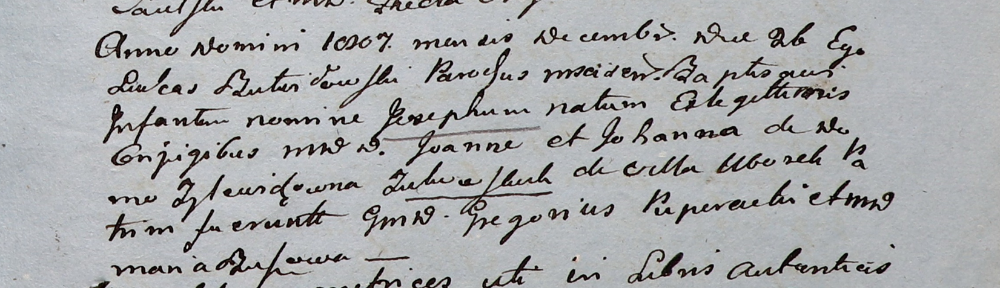

**Жуковская (Зылевич) Иоанна (Zukowska Johanna z Zylewiczow)**

26 декабря 1807 г -- крещение сына Иосифа (НИАБ 937-4-32, лист 17,
№26/1807-р).

**НИАБ 937-4-32:** Лист 17. **Метрическая запись №26/1807-р.**

{width="6.496527777777778in"
height="1.8770833333333334in"}

Дедиловичский костел Наисвятейшего Сердца Иисуса. 26 декабря 1807 года.
Метрическая запись о крещении.

Zukowski Joseph -- сын шляхтичей с деревни Уборок.

Zukowski Joann -- отец.

Zukowska Johanna z Zylewiczow -- мать.

Puperach? Gregorius -- крестный отец, шляхтич.

Busowa? Maria -- крестная мать, шляхтянка.

Butwiłowski Łukas -- ксёндз, администратор Мстижский.
