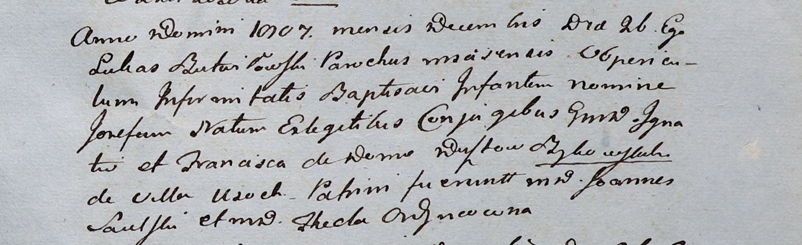

**Быковский Игнатий (Bykowski Jgnati)**

26 декабря 1807 г -- крещение сына Иосифа (НИАБ 937-4-32, лист 17,
№25/1807-р).

**НИАБ 937-4-32:** Лист 17. **Метрическая запись №25/1807-р.**

{width="6.496527777777778in"
height="1.9909722222222221in"}

Дедиловичский костел Наисвятейшего Сердца Иисуса. 26 декабря 1807 года.
Метрическая запись о крещении.

Bykowski Josef -- сын шляхтичей с деревни Усохи.

Bykowski Jgnati -- отец.

Bykowska Francisca z ..ustow-- мать.

Saulski Joann -- крестный отец, шляхтич.

Odyncowna Thecla -- крестная мать, шляхтянка.

Butwiłowski Łukas -- ксёндз, администратор Мстижский.
