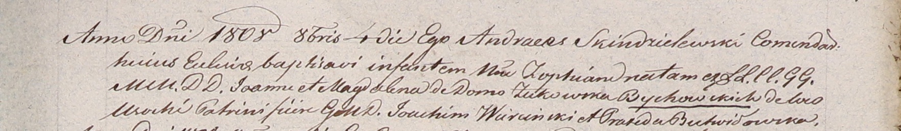

**Быковский Иоанн (Bychowski Joann)**

4 октября 1808 г -- крещение дочери Зофии (НИАБ 937-4-32, лист 19,
№25/1808-р).

**НИАБ 937-4-32:** Лист 19. **Метрическая запись №25/1808-р.**

{width="6.496527777777778in"
height="0.95in"}

Дедиловичский костел Наисвятейшего Сердца Иисуса. 4 октября 1808 года.
Метрическая запись о крещении.

Bychowska Zophia -- дочь шляхтичей с деревни Усохи.

Bychowski Joann -- отец.

Bychowska Magdalena z Zukowskich -- мать.

Wiercinski Joahim -- крестный отец, шдяхтич.

Butwiłowska Praxeda -- крестная мать, шляхтянка.

Scindzelewski Andreas -- ксёндз, комендант Дедиловичский.
