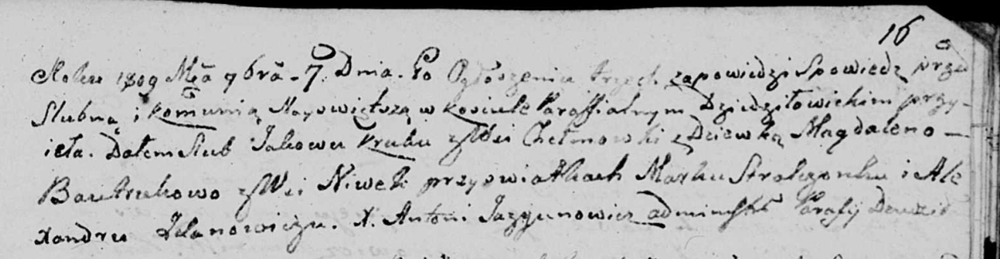

**Крук (в девичестве Бавтрук) Магдалена (Krukowa Magdalena z
Bautrukow)**

7 ноября 1809 г -- венчание с Яковом Круком с деревни Хельмовка (НИАБ
136-13-920, лист 16, №17/1809-б (ориг)).

**НИАБ 136-13-920:** Лист 16. **Метрическая запись №17/1809-б (ориг).**

Дедиловичская Покровская церковь. 7 ноября 1809 года. Метрическая запись
о венчании.

Kruk Jakow -- жених, с деревни Хельмовка.

Bautrukowa Magdalena -- невеста, девка с деревни Нивки.

Stralczonek Mark -- свидетель.

Żdanowicz Alexander -- свидетель.

Jazgunowicz Antoni -- ксёндз.
