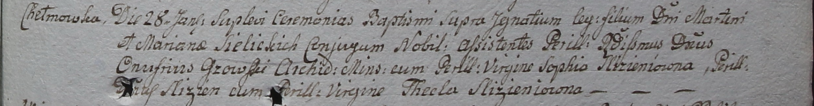

**Селицкий Игнатий Мартинов, шляхтич (Sielicki Jgnati)**

28 января 1799 г -- крещение сына Игнатия (НИАБ 1781-27-199, лист 125,
№13/1799-б).

**НИАБ 1781-27-199:** Лист 125. **Метрическая запись №13/1799-р.**

Дедиловичский костел Наисвятейшего Сердца Иисуса. 28 января 1799 года.
Метрическая запись о крещении.

Sielicki Jgnati -- сын шляхтичей с деревни Хельмовка.

Sielicki Martin -- отец.

Sielicka Mariana -- мать.

Growski Onufri -- крестный отец, шляхтич, архидиакон Минский.

Slizieniowna Sofia - крестная мать, шляхтянка, девица.

Slizien D\...s -- ассистент, шляхтич.

Slizieniowna Thekla -- ассистентка, шляхтянка, девица.

Linhart Hyacinthus -- ксёндз.
