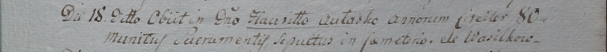

**Авласко Гаврило (Aułasko Hauriłło)**

18 декабря 1799 г -- отпевание, умер в возрасте 80 лет (родился около
1719 г) (НИАБ 1781-27-199, лист 131, №23/1799-у).

**НИАБ 1781-27-199:** Лист 131. **Метрическая запись №23/1799-у.**

Дедиловичский костел Наисвятейшего Сердца Иисуса. 18 декабря 1799 года.
Метрическая запись об отпевании.

Aułasko Hauriłło -- умерший, 80 лет, с деревни Васильковка.

Linhart Hyacinthus -- ксёндз.
