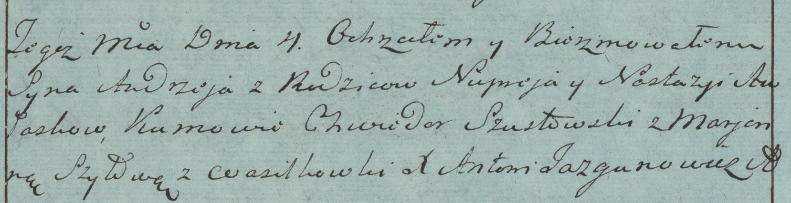

**Авласко Андрей Нупреев (Awłasko Andrzey)**

4 июля 1783 г -- крещение (РГИА 823-2-18, лист 224об, №18/1783-р (коп)).

**РГИА 823-2-18:** Лист 224об. **Метрическая запись №18/1783-р (коп).**

Дедиловичская Покровская церковь. 4 июля 1783 года. Метрическая запись о
крещении.

Awłasko Andrzey -- сын родителей с деревни Васильковка.

Awłasko Nuprey -- отец.

Awłaskowa Nastazya -- мать.

Szustowski Chwiedor -- кум.

Szyłowa Marjanna - кума.

Jazgunowicz Antoni -- ксёндз.
