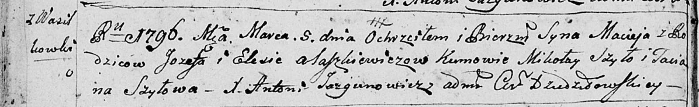

**Алешкевич Мацей Иосифов (Alaszkiewicz Maciey)**

5 марта 1796 г -- крещение (НИАБ 136-13-894, лист 28об, №27/1796-р
(ориг)).

**НИАБ 136-13-894:** Лист 28-об. **Метрическая запись №27/1796-р
(ориг).**

{width="6.496527777777778in"
height="0.9997233158355205in"}

Дедиловичская Покровская церковь. 5 марта 1796 года. Метрическая запись
о крещении.

Alaszkiewicz Maciey -- сын родителей с деревни Васильковка.

Alaszkiewicz Jozef -- отец.

Alaszkiewiczowa Elesia -- мать.

Szyło Mikolay - кум.

Szyłowa Taciana - кума.

Jazgunowicz Antoni -- ксёндз.
