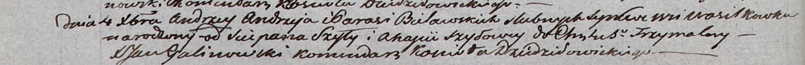

**Белявский Андрей Андреев (Bielawski Andrzey)**

4 декабря 1803 г -- крещение (НИАБ 937-4-32, лист 9об, №30/1803-р)).

**НИАБ 937-4-32:** Лист 9об. **Метрическая запись №30/1803-р.**

{width="6.496527777777778in"
height="0.5263888888888889in"}

Дедиловичский костел Наисвятейшего Сердца Иисуса. 4 декабря 1803 года.
Метрическая запись о крещении.

Bielawski Andrzey -- сын родителей с деревни Васильковка.

Bieliawski Andrzey -- отец.

Bielawska Parasia -- мать.

Szyło Sciepan -- крестный отец.

Szyłowa Ahafia -- крестная мать, с деревни Отруб.

Galinowski Joann -- ксёндз, комендант Дедиловичского костела.
