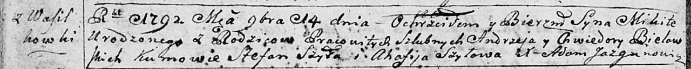
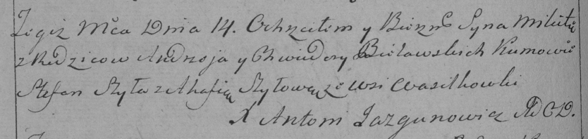

**Белявский Микита Андреев (Bielawski Mikita)**

14 ноября 1792 г -- крещение (НИАБ 136-13-894, лист 17об, №73/1792-р
(ориг)), (РГИА 823-2-18, лист 245, №34/1792-р (коп)).

**НИАБ 136-13-894:** Лист 17-об. **Метрическая запись №73/1792-р
(ориг).**

Дедиловичская Покровская церковь. 14 ноября 1792 года. Метрическая
запись о крещении.

Bielawski Mikita -- сын селян с деревни Васильковка.

Bielawski Andrzey -- отец.

Bielawska Chwiedora -- мать.

Szyło Stefan - кум.

Szyłowa Ahafija - кума.

Jazgunowicz Antoni -- ксёндз.

**РГИА 823-2-18:** Лист 245об. **Метрическая запись №34/1792-р (коп).**

Дедиловичская Покровская церковь. 14 ноября 1792 года. Метрическая
запись о крещении.

Bielawski Mikita -- сын родителей с деревни Васильковка.

Bielawski Andrzey -- отец.

Bielawska Chwiedora -- мать.

Szyło Stefan -- кум.

Szyłowa Ahafia -- кума.

Jazgunowicz Antoni -- ксёндз.
