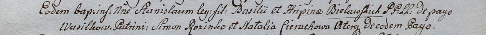

**Белявский Базылий (Bielawski Bazyli)**

14 июня 1797 г -- крещение сына Иосифа (НИАБ 136-13-894, лист 33об,
№38/1797-р (ориг)), (РГИА 823-2-18, лист 260, №26/1797-р (коп)).

7 июня 1800 г -- крещение сына Станислава (НИАБ 937-4-32, лист 2,
№18/1800-р).

**НИАБ 136-13-894:** Лист 33об. **Метрическая запись №38/1797-р
(ориг).**

{width="6.496527777777778in"
height="0.8488604549431321in"}

Дедиловичская Покровская церковь. 14 июня 1797 года. Метрическая запись
о крещении.

Bialawski Jozef -- сын родителей с деревни Васильковка.

Bialawski Bazyli -- отец.

Bialawska Rypina -- мать.

Rozynka Symon - кум.

Cierachowa Natalla - кума.

Jazgunowicz Antoni -- ксёндз.

**РГИА 823-2-18:** Лист 260. **Метрическая запись №26/1797-р (коп).**

{width="6.496527777777778in"
height="1.5284722222222222in"}

Дедиловичская Покровская церковь. 14 июня 1797 года. Метрическая запись
о крещении.

Bielawski Jozef -- сын родителей с деревни Васильковка.

Bielawski Bazyli -- отец.

Bielawska Rypina -- мать.

Rozynka Symon -- кум.

Cierachowa Natalla -- кума.

Jazgunowicz Antoni -- ксёндз.

**НИАБ 937-4-32: Метрическая запись №18/1800-р.**

{width="6.496527777777778in"
height="0.4840277777777778in"}

Дедиловичский костел Наисвятейшего Сердца Иисуса. 7 июня 1800 года.
Метрическая запись о крещении.

Bielawski Stanisław -- сын крестьян с деревни Васильковка.

Bielawski Basili -- отец.

Bielawska Hripina -- мать.

Rozinko Simon -- крестный отец, с деревни Васильковка.

Cierachowa Natalia -- крестная мать, с деревни Васильковка.

Linhart Hyacinthus -- ксёндз.
