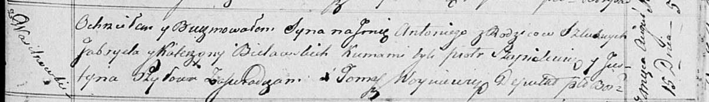

**Белявский Антон Гаврылов (Bielawski Antony)**

15 августа 1817 г -- крещение (НИАБ 136-13-894, лист 97, №50/1817-р
(ориг)).

**НИАБ 136-13-894:** Лист 97. **Метрическая запись №50/1817-р (ориг).**

{width="6.496527777777778in"
height="0.9427307524059493in"}

Осовская Покровская церковь. 15 августа 1817 года. Метрическая запись о
крещении.

Bielawski Antony -- сын родителей с деревни Васильковка.

Bielawski Gabriel -- отец.

Bielawska Katerzyna -- мать.

Szapialewicz Piotr -- кум.

Szyłowa Justyna -- кума.

Woyniewicz Tomasz -- ксёндз.
