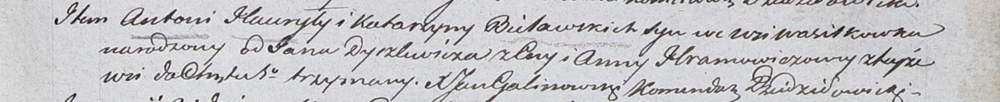
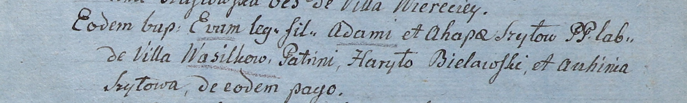
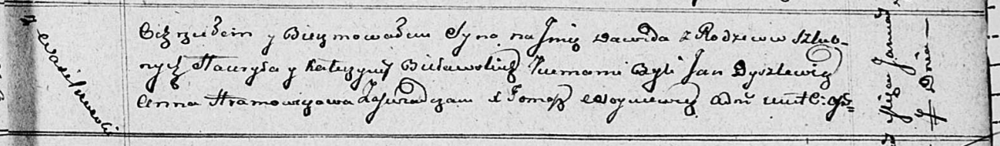

**Белявский Гаврыла (Bielawski Hauryła, Gabriel)**

17 января 1804 г -- крещение сына Антона старшего (НИАБ 937-4-32, лист
10, №2/1804-р).

2 января 1805 г -- крестный отец Евы, дочери Адама и Агапы Шил с деревни
Васильковка (НИАБ 937-4-32, лист 11, №4/1805-р).

7 января 1812 г -- крещение сына Давида (НИАБ 136-13-894, лист 83,
№2/1812-р (ориг)).

15 августа 1817 г -- крещение сына Антона (НИАБ 136-13-894, лист 97,
№50/1817-р (ориг)).

**НИАБ 937-4-32:** Лист 10. **Метрическая запись №2/1804-р.**

Дедиловичский костел Наисвятейшего Сердца Иисуса. 17 января 1804 года.
Метрическая запись о крещении.

Bielawski Antoni -- сын родителей с деревни Васильковка.

Bielawski Hauryła -- отец.

Bielawska Katarzyna -- мать.

Dyrzlewicz Jan -- крестный отец.

Hramowiczowa Anna -- крестная мать, с деревни Васильковка.

Galinowski Joann -- ксёндз, комендант Дедиловичского костела.

**НИАБ 937-4-32:** Лист 11. **Метрическая запись №4/1805-р.**

Дедиловичский костел Наисвятейшего Сердца Иисуса. 2 января 1805 года.
Метрическая запись о крещении.

Szyłowna Eva -- дочь крестьян с деревни Васильковка.

Szyło Adam -- отец.

Szyłowa Ahapa -- мать.

Bielawski Haryło -- крестный отец, с деревни Васильковка.

Szyłowa Auchinia -- крестная мать, с деревни Васильковка.

Linhart Hiacinthus -- ксёндз.

**НИАБ 136-13-894:** Лист 83. **Метрическая запись №2/1812-р (ориг).**

Осовская Покровская церковь. 7 января 1812 года. Метрическая запись о
крещении.

Bielawski Dawid -- сын родителей с деревни Васильковка.

Bielawski Hauryła -- отец.

Bielawska Katerzyna -- мать.

Dyszlewicz Jan -- кум.

Hramowiczowa Anna -- кума.

Woyniewicz Tomasz -- ксёндз.

**НИАБ 136-13-894:** Лист 97. **Метрическая запись №50/1817-р (ориг).**

Осовская Покровская церковь. 15 августа 1817 года. Метрическая запись о
крещении.

Bielawski Antony -- сын родителей с деревни Васильковка.

Bielawski Gabriel -- отец.

Bielawska Katerzyna -- мать.

Szapialewicz Piotr -- кум.

Szyłowa Justyna -- кума.

Woyniewicz Tomasz -- ксёндз.
