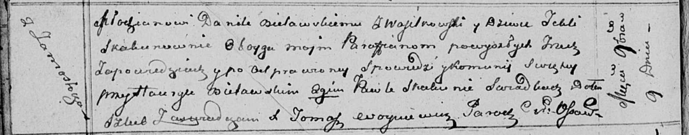

**Белявская (в девичестве Скакун) Текля (Bielawska Tekla z Skakunow)**

9 ноября 1813 г -- венчание с молодым Данилой Белявским с деревни
Васильковка (НИАБ 136-13-920, лист 20об, №27/1813-б (коп)).

**НИАБ 136-13-920:** Лист 20об. **Метрическая запись №27/1813-б
(ориг).**

{width="6.496527777777778in"
height="1.2773129921259843in"}

Оссовская Покровская церковь. 9 ноября 1813 года. Запись о венчании.

Bielawski Daniła -- жених, молодой, парафии Осовской, с деревни
Васильковка.

Skakunowna Tekla -- невеста, девка, парафии Осовской, с деревни
Замосточье.

Bielawski Hawryła -- свидетель.

Skakun Paweł -- свидетель.

Woyniewicz Tomasz -- ксёндз.
