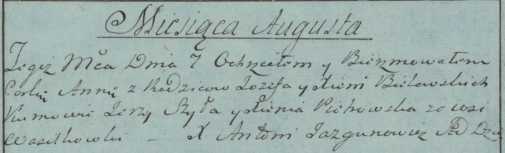

**Белявский Иосиф (Bielawski Jozef)**

4 августа 1783 г -- крещение дочери Анны (РГИА 823-2-18, лист 225,
№21/1783-р (коп)).

**РГИА 823-2-18:** Лист 225. **Метрическая запись №21/1783-р (коп).**

{width="6.496527777777778in"
height="1.9729166666666667in"}

Дедиловичская Покровская церковь. 7 августа 1783 года. Метрическая
запись о крещении.

С Васильковки.

Bielawska Anna -- дочь родителей с деревни Васильковка.

Bielawski Jozef -- отец.

Bielawska Xienia -- мать.

Szyła Jerzy -- кум.

Piehowska Xienia - кума.

Jazgunowicz Antoni -- ксёндз.
