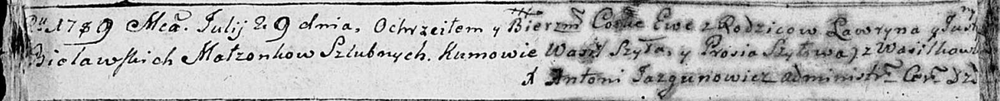

**Белявская Ева Лаврынова (Bielawska Ewa)**

29 июля 1789 г -- крещение (НИАБ 136-13-894, лист 7об, №42/1789-р
(ориг)).

**НИАБ 136-13-894:** Лист 7об. **Метрическая запись №42/1789-р (ориг).**

{width="6.496527777777778in"
height="0.6584361329833771in"}

Дедиловичская Покровская церковь. 29 июля 1789 года. Метрическая запись
о крещении.

Bielawska Ewa -- дочь родителей с деревни Васильковка.

Bielawski Lawryn -- отец.

Bielawska Justyna -- мать.

Szyło Wasil - кум.

Szyłowa Prosia - кума.

Jazgunowicz Antoni -- ксёндз.
