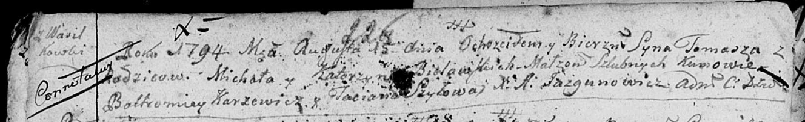

**Белявская (Каржевич) Катерына (Bielawska Katerzyna z Karżewiczow)**

2 мая 1787 г -- венчание с Михалом Белявским (НИАБ 136-13-894, лист 66,
№5/1787-б (ориг)).

29 октября 1788 г -- крещение сына Адама (НИАБ 136-13-894, лист 5об,
№55/1788-р (ориг)).

15 августа 1794 г -- крещение сына Хомы (НИАБ 136-13-894, лист 22об,
№31/1794-р (ориг)), (РГИА 823-2-18, лист 250, №21/1794-р (коп)).

4 октября 1798 г -- крещение дочери Юстыны (НИАБ 136-13-894, лист 37,
№51/1798-р (ориг)), (РГИА 823-2-18, лист 266об, №52/1798-р (коп)).

**НИАБ 136-13-894:** Лист 66. **Метрическая запись №5/1787-б (ориг).**

{width="6.496527777777778in"
height="0.8669641294838145in"}

Дедиловичская Покровская церковь. 2 мая 1787 года. Метрическая запись о
венчании.

Bielawski Michaś -- жених с деревни \[Васильковка\].

Karżewiczowa Katerzyna -- невеста.

Szustowski Leon -- свидетель.

Jazgunowicz Antoni -- ксёндз.

**НИАБ 136-13-894:** Лист 5об. **Метрическая запись №55/1788-р (ориг).**

{width="6.496527777777778in"
height="0.8649518810148732in"}

Дедиловичская Покровская церковь. 29 октября 1788 года. Метрическая
запись о крещении.

Bielawski Adam -- сын родителей с деревни Васильковка.

Bielawski Michał-- отец.

Bielawska Katerzyna -- мать.

Szyło Bautruk - кум.

Szyłowa Taciana - кума.

Jazgunowicz Antoni -- ксёндз.

**НИАБ 136-13-894:** Лист 22об. **Метрическая запись №31/1794-р
(ориг).**

{width="6.496527777777778in"
height="0.9930183727034121in"}

Дедиловичская Покровская церковь. 15 августа 1794 года. Метрическая
запись о крещении.

Bielawski Tomasz -- сын родителей с деревни Васильковка.

Bielawski Michał -- отец.

Bielawska Katerzyna -- мать.

Karżewicz Bałtromey - кум.

Szyłowa Taćiana - кума.

Jazgunowicz Antoni -- ксёндз.

**РГИА 823-2-18:** Лист 250. **Метрическая запись №22/1794-р (коп).**

{width="6.496527777777778in"
height="1.6576388888888889in"}

Дедиловичская Покровская церковь. 15 августа 1794 года. Метрическая
запись о крещении.

Bielawski Tomasz -- сын родителей с деревни Васильковка.

Bielawski Michał -- отец.

Bielawska Katarzyna -- мать.

Karżewicz Bałtromiey -- кум.

Szyłowa Tacianna -- кума.

Jazgunowicz Antoni -- ксёндз.

**НИАБ 136-13-894:** Лист 37. **Метрическая запись №51/1798-р (ориг).**

{width="6.496527777777778in"
height="1.083536745406824in"}

Дедиловичская Покровская церковь. 4 октября 1798 года. Метрическая
запись о крещении.

Bielawska Justyna -- дочь родителей с деревни Васильковка.

Bielawski Michaś -- отец.

Bielawska Katerzyna -- мать.

Szyło Michaś - кум.

Szyłowa Taciana - кума.

Jazgunowicz Antoni -- ксёндз.

**РГИА 823-2-18:** Лист 266об. **Метрическая запись №52/1798-р (коп).**

{width="6.496527777777778in"
height="1.31875in"}

Дедиловичская Покровская церковь. 4 октября 1798 года. Метрическая
запись о крещении.

Bielawska Justyna -- дочь родителей с деревни Васильковка.

Bielawski Michaś -- отец.

Bielawska Katerzyna -- мать.

Szyła Michas -- кум.

Szyłowa Taciana -- кума.

Jazgunowicz Antoni -- ксёндз.
