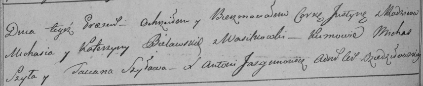

**Белявская Юстына Михалова (Bielawska Justyna)**

4 октября 1798 г -- крещение (НИАБ 136-13-894, лист 37, №51/1798-р
(ориг)), (РГИА 823-2-18, лист 266об, №52/1798-р (коп)).

**НИАБ 136-13-894:** Лист 37. **Метрическая запись №51/1798-р (ориг).**

Дедиловичская Покровская церковь. 4 октября 1798 года. Метрическая
запись о крещении.

Bielawska Justyna -- дочь родителей с деревни Васильковка.

Bielawski Michaś -- отец.

Bielawska Katerzyna -- мать.

Szyło Michaś - кум.

Szyłowa Taciana - кума.

Jazgunowicz Antoni -- ксёндз.

**РГИА 823-2-18:** Лист 266об. **Метрическая запись №52/1798-р (коп).**

Дедиловичская Покровская церковь. 4 октября 1798 года. Метрическая
запись о крещении.

Bielawska Justyna -- дочь родителей с деревни Васильковка.

Bielawski Michaś -- отец.

Bielawska Katerzyna -- мать.

Szyła Michas -- кум.

Szyłowa Taciana -- кума.

Jazgunowicz Antoni -- ксёндз.
