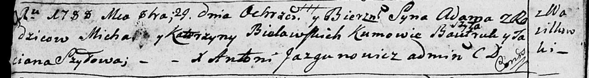

**Белявский Адам Михалов (Bielawski Adam)**

29 октября 1788 г -- крещение (НИАБ 136-13-894, лист 5об, №55/1788-р
(ориг)).

**НИАБ 136-13-894:** Лист 5об. **Метрическая запись №55/1788-р (ориг).**

{width="6.496527777777778in"
height="0.8649518810148732in"}

Дедиловичская Покровская церковь. 29 октября 1788 года. Метрическая
запись о крещении.

Bielawski Adam -- сын родителей с деревни Васильковка.

Bielawski Michał-- отец.

Bielawska Katerzyna -- мать.

Szyło Bautruk - кум.

Szyłowa Taciana - кума.

Jazgunowicz Antoni -- ксёндз.
