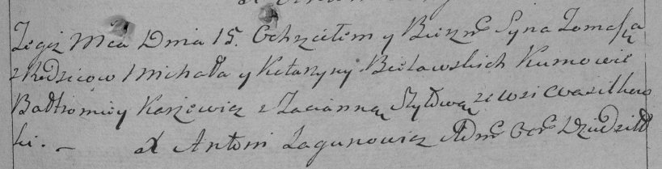

**Белявский Хома Михалов (Bielawski Tomasz)**

15 августа 1794 г -- крещение (НИАБ 136-13-894, лист 22об, №31/1794-р
(ориг)), (РГИА 823-2-18, лист 250, №21/1794-р (коп)).

**НИАБ 136-13-894:** Лист 22об. **Метрическая запись №31/1794-р
(ориг).**

{width="6.496527777777778in"
height="0.9930183727034121in"}

Дедиловичская Покровская церковь. 15 августа 1794 года. Метрическая
запись о крещении.

Bielawski Tomasz -- сын родителей с деревни Васильковка.

Bielawski Michał -- отец.

Bielawska Katerzyna -- мать.

Karżewicz Bałtromey - кум.

Szyłowa Taćiana - кума.

Jazgunowicz Antoni -- ксёндз.

**РГИА 823-2-18:** Лист 250. **Метрическая запись №22/1794-р (коп).**

{width="6.496527777777778in"
height="1.6576388888888889in"}

Дедиловичская Покровская церковь. 15 августа 1794 года. Метрическая
запись о крещении.

Bielawski Tomasz -- сын родителей с деревни Васильковка.

Bielawski Michał -- отец.

Bielawska Katarzyna -- мать.

Karżewicz Bałtromiey -- кум.

Szyłowa Tacianna -- кума.

Jazgunowicz Antoni -- ксёндз.
