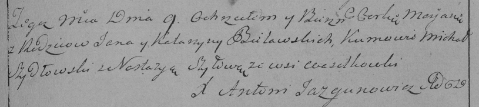

**Белявский Ян (Bielawski, Bialawski Jan, Janka)**

7 октября 1792 г -- свидетель при венчании Игната Воробья с деревни
Литвичи с Маланией Шило с деревни Васильковка (НИАБ 136-13-894, лист 71,
№13/1792-б (ориг)).

9 ноября 1794 г -- крещение дочери Марьяны (НИАБ 136-13-894, лист 31,
№94/1796-р (ориг)), (РГИА 823-2-18, лист 258, №58/1796-р (коп)).

**НИАБ 136-13-894:** Лист 71. **Метрическая запись №13/1792-б (ориг).**

{width="6.496527777777778in"
height="1.3933103674540683in"}

Дедиловичская Покровская церковь. 7 октября 1792 года. Метрическая
запись о венчании.

Wiarabiey Jhnat -- жених, с деревни Лицвичи.

Szyłowna Małanieja -- невеста, с деревни Васильковка.

Laudanski Prakop -- свидетель, с деревни Лицвичи.

Bialawski Janka -- свидетель, с деревни Васильковка.

Jazgunowicz Antoni -- ксёндз.

**НИАБ 136-13-894:** Лист 31. **Метрическая запись №94/1796-р (ориг).**

{width="6.496527777777778in"
height="1.1157206911636046in"}

Дедиловичская Покровская церковь. 9 ноября 1796 года. Метрическая запись
о крещении.

Bielawska Marjana -- дочь родителей с деревни Васильковка.

Bielawski Jan -- отец.

Bielawska Katerzyna -- мать.

Szydłowski Michal -- кум.

Szyłowa Nastazyia - кума.

Jazgunowicz Antoni -- ксёндз.

**РГИА 823-2-18:** Лист 258. **Метрическая запись №58/1796-р (коп).**

{width="6.496527777777778in"
height="1.4506944444444445in"}

Дедиловичская Покровская церковь. 9 ноября 1796 года. Метрическая запись
о крещении.

Bielawska Marjana -- дочь родителей с деревни Васильковка.

Bielawski Jan -- отец.

Bielawska Katarzyna -- мать.

Szydłowski Michał -- кум.

Szyłowa Nastazya -- кума.

Jazgunowicz Antoni -- ксёндз.
