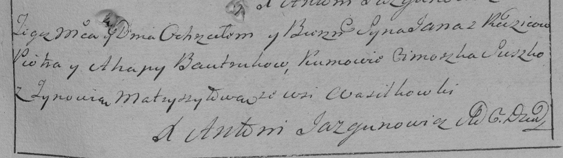

**Бутрук Ян Петров (Butruk Jan)**

27 декабря 1796 г -- крещение (НИАБ 136-13-894, лист 31об, №100/1796-р
(ориг)), (РГИА 823-2-18, лист 258, №63/1796-р (коп)).

**НИАБ 136-13-894:** Лист 31-об. **Метрическая запись №100/1796-р
(ориг).**

{width="6.496527777777778in"
height="0.9199332895888014in"}

Дедиловичская Покровская церковь. 27 декабря 1796 года. Метрическая
запись о крещении.

Butruk Jan -- сын родителей с деревни Василькова.

Butruk Piotr -- отец.

Butruk Hapa -- мать.

Suszko Cimoszka - кум.

Metryszyłowa Zynowija - кума.

Jazgunowicz Antoni -- ксёндз.

**РГИА 823-2-18:** Лист 258. **Метрическая запись №63/1796-р (коп).**

{width="6.496527777777778in"
height="1.8291666666666666in"}

Дедиловичская Покровская церковь. 27 декабря 1796 года. Метрическая
запись о крещении.

Bautruk Jan -- сын родителей с деревни Васильковка.

Bautruk Piotr -- отец.

Bautrukowa Ahapa -- мать.

Suszko Cimoszka -- кум.

Matryszyłowa Zynowia -- кума.

Jazgunowicz Antoni -- ксёндз.
