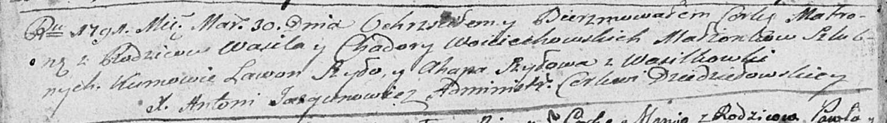

**Войцеховский Василь (Woiciechowski Wasil)**

30 марта 1791 г -- крещение дочери Матроны (НИАБ 136-13-894, лист 12об,
№12/1791-р (ориг)).

**НИАБ 136-13-894:** Лист 12об. **Метрическая запись №12/1791-р
(ориг).**

{width="6.496527777777778in"
height="0.9092049431321085in"}

Дедиловичская Покровская церковь. 30 марта 1791 года. Метрическая запись
о крещении.

Woiciechowska Matrona -- дочь родителей с деревни Васильковка.

Woiciechowski Wasil -- отец.

Woiciechowska Chodora -- мать.

Szyło Lawon - кум.

Szyłowa Ahapa - кума.

Jazgunowicz Antoni -- ксёндз.
