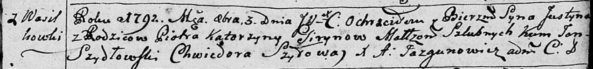
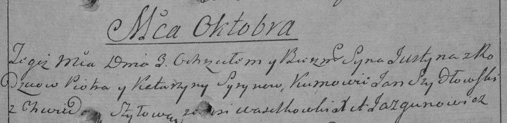

**Гирин Юстын Петров (Giryn Justyn)**

3 октября 1792 г -- крещение (НИАБ 136-13-894, лист 17, №59/1792-р
(ориг)), (РГИА 823-2-18, лист 245, №28/1792-р (коп)).

Лист 17. **Метрическая запись №59/1792-р (ориг).**

Дедиловичская Покровская церковь. 3 октября 1792 года. Метрическая
запись о крещении.

Giryn Justyn -- сын родителей с деревни Васильковка.

Giryn Piotr -- отец.

Giryna Katerzyna -- мать.

Szydłowski Jan - кум.

Szyłowa Chwiedora - кума.

Jazgunowicz Antoni -- ксёндз.

**РГИА-823-2-18:** Лист 245. **Метрическая запись №28/1792-р (коп).**

Дедиловичская Покровская церковь. 3 октября 1792 года. Метрическая
запись о крещении.

\[Giryn\] Justyn -- сын родителей с деревни Васильковка.

\[Giryn\] Piotr -- отец.

\[Giryna\] Katarzyna -- мать.

Szydłowski Jan -- кум.

Szyłowa Chwiedora -- кума.

Jazgunowicz Antoni -- ксёндз.
