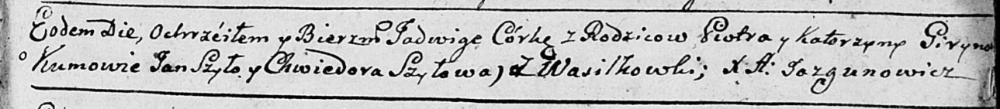

**Гирина Ядвига Петрова (Girynowna Jadwiga)**

9 ноября 1790 г -- крещение (НИАБ 136-13-894, лист 12, №83/1790-р
(ориг)).

**НИАБ 136-13-894:** Лист 12. **Метрическая запись №83/1790-р (ориг).**

{width="6.496527777777778in"
height="0.7107360017497812in"}

Дедиловичская Покровская церковь. 9 ноября 1790 года. Метрическая запись
о крещении.

Girynowna Jadwiga -- дочь родителей с деревни Васильковка.

Giryn Piotr -- отец.

Girynowa Katerzyna -- мать.

Szyło Jan - кум.

Szyłowa Chwiedora - кума.

Jazgunowicz Antoni -- ксёндз.
