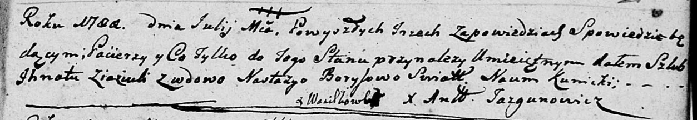

**Зязюля Игнат (Ziaziula Jhnat)**

Июль 1788 г -- венчание с Настасьей Борисовой (НИАБ 136-13-894, лист 67,
№7/1788-б (ориг)).

**НИАБ 136-13-894:** Лист 67. **Метрическая запись №7/1788-б (ориг).**

Дедиловичская Покровская церковь. Июль 1788 года. Метрическая запись о
венчании.

Ziaziula Jhnat -- жених с деревни Васильковка.

Borysowa Nastacya -- невеста, вдова.

Kunicki Naum -- свидетель.

Jazgunowicz Antoni -- ксёндз.
