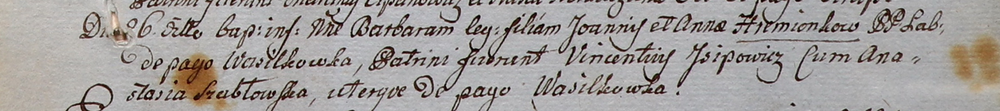
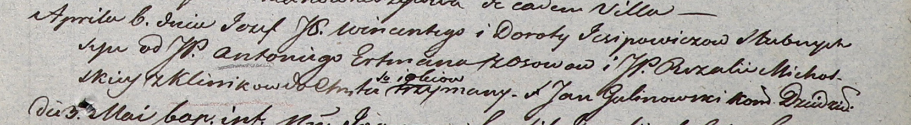

**Исипович Винценты (Jsipowicz Vincenti)**

5 августа 1800 г -- крещение сына Доминика (НИАБ 937-4-32, лист 2,
№24/1800-р).

26 августа 1800 г -- крестный отец Барбары, дочери Иоанна и Анны
Гременков с деревни Васильковка (НИАБ 937-4-32, лист 2, №27/1800-р).

6 апреля 1803 г -- крещение сына Иосифа (НИАБ 937-4-32, лист 9,
№10/1803-р).

**НИАБ 937-4-32.** Лист 2. **Метрическая запись №24/1800-р.**

Дедиловичский костел Наисвятейшего Сердца Иисуса. 5 августа 1800 года.
Метрическая запись о крещении.

Jsjpowicz Dominic -- сын вольных людей с деревни Васильковка.

Jsjpowicz Vincenti -- отец.

Jsjpowiczowa Dorothea -- мать.

Chodasewicz Thadeusz -- крестный отец, шляхтич, с деревни Дедиловичи.

Sutowska Anna -- крестная мать, с деревни Дедиловичи.

Linhart Hyacinthus -- ксёндз.

**НИАБ 937-4-32:** Лист 2. **Метрическая запись №27/1800-р.**

Дедиловичский костел Наисвятейшего Сердца Иисуса. 26 августа 1800 года.
Метрическая запись о крещении.

Hremionkowna Barbara -- дочь крестьян с деревни Васильковка.

Hremionok Joann -- отец.

Hremionkowa Anna -- мать.

Jsipowicz Vincentiusz -- крестный отец, с деревни Васильковка.

Szabłowska Anastasia -- крестная мать, с деревни Васильковка.

Linhart Hyacinthus -- ксёндз.

**НИАБ 937-4-32:** Лист 9. **Метрическая запись №10/1803-р.**

Дедиловичский костел Наисвятейшего Сердца Иисуса. 6 апреля 1803 года.
Метрическая запись о крещении.

Jsipowicz Jozef -- сын вольных людей с деревни \[Васильковка\].

Jsipowicz Wincenty -- отец.

Jsipowiczowa Dorota -- мать.

Ertman Antoni -- крестный отец, шляхтич, с деревни Осово.

Michalska Rozalia -- крестная мать, шляхтянка, с деревни Клинники.

Galinowski Joann -- ксёндз, комендант Дедиловичского костела.
