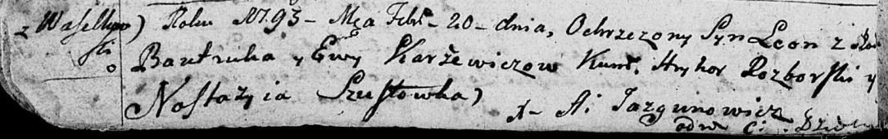

**Каржевич Ева (Karżewiczowa Ewa)**

20 февраля 1793 г -- крещение сына Леона (НИАБ 136-13-894, лист 18об,
№19/1793-р (ориг)).

**НИАБ 136-13-894:** Лист 18-об. **Метрическая запись №19/1793-р
(ориг).**

{width="6.496527777777778in"
height="1.0245319335083114in"}

Дедиловичская Покровская церковь. 20 февраля 1793 года. Метрическая
запись о крещении.

Karżewicz Leon -- сын родителей с деревни Васильковка.

Karżewicz Bautruk -- отец.

Karżewicz Ewa -- мать.

Rozborski Hryhor - кум.

Szustowska Nastazyia - кума.

Jazgunowicz Antoni -- ксёндз.
