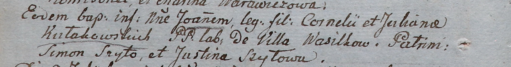

**Кулаковская Юхана (Kułakowska Juchana)**

25 июня 1805 г -- крещение сына Иоанна (НИАБ 937-4-32, лист 11об,
№23/1805-р).

**НИАБ 937-4-32:** Лист 11об. **Метрическая запись №23/1805-р.**

Дедиловичский костел Наисвятейшего Сердца Иисуса. 25 июня 1805 года.
Метрическая запись о крещении.

Kułakowski Joann -- сын крестьян с деревни Васильковка.

Kułakowski Corneli -- отец.

Kułakowska Juchana -- мать.

Szyło Simon -- крестный отец.

Szyłowa Justina -- крестная мать.

Linhart Hiacinthus -- ксёндз.
