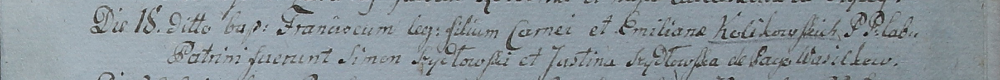
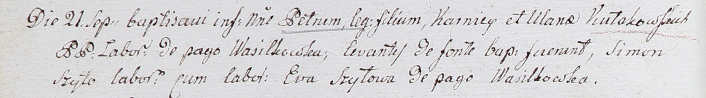

**Кулаковская Эмилиана (Kolikowska Emiliana, Ulana)**

18 сентября 1799 г -- крещение сына Франциска (НИАБ 1781-27-199, лист
129, №42/1799-р).

21 сентября 1802 г -- крещение сына Петра (НИАБ 937-4-32, лист 7об,
№32/1802-р).

**НИАБ 1781-27-199:** Лист 129. **Метрическая запись №42/1799-р.**

Дедиловичский костел Наисвятейшего Сердца Иисуса. 18 сентября 1799 года.
Метрическая запись о крещении.

Kolikowski Francisc -- сын крестьян с деревни Васильковка.

Kolikowski Corney -- отец.

Kolikowska Emiliana -- мать.

Szydłowski Simon -- крестный отец.

Szydłowska Justina -- крестная мать.

Linhart Hyacinthus -- ксёндз.

**НИАБ 937-4-32:** Лист 7об. **Метрическая запись №32/1802-р.**

Дедиловичский костел Наисвятейшего Сердца Иисуса. 21 сентября 1802 года.
Метрическая запись о крещении.

Kułakowski Petrus -- сын крестьян с деревни Васильковка.

Kułakowski Karniey -- отец.

Kułakowska Ulana -- мать.

Szyło Simon -- крестный отец, крестьянин, с деревни Васильковка.

Szyłowa Eva -- крестная мать, крестьянка, с деревни Васильковка.

Linhart Hyacinthus -- ксёндз.
