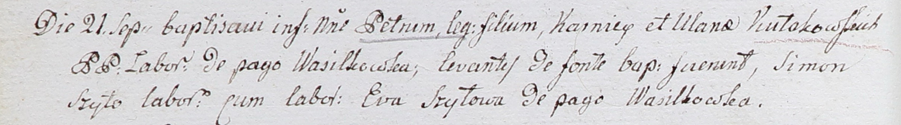

**Кулаковский Пётр Корнеев (Kułakowski Piotr)**

21 сентября 1802 г -- крещение (НИАБ 937-4-32, лист 7об, №32/1802-р).

**НИАБ 937-4-32:** Лист 7об. **Метрическая запись №32/1802-р.**

Дедиловичский костел Наисвятейшего Сердца Иисуса. 21 сентября 1802 года.
Метрическая запись о крещении.

Kułakowski Petrus -- сын крестьян с деревни Васильковка.

Kułakowski Karniey -- отец.

Kułakowska Ulana -- мать.

Szyło Simon -- крестный отец, крестьянин, с деревни Васильковка.

Szyłowa Eva -- крестная мать, крестьянка, с деревни Васильковка.

Linhart Hyacinthus -- ксёндз.
