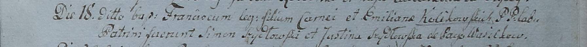

**Кулаковский Франциск Корнеев (Kolikowski Francisc)**

18 сентября 1799 г -- крещение (НИАБ 1781-27-199, лист 129, №42/1799-р).

**НИАБ 1781-27-199:** Лист 129. **Метрическая запись №42/1799-р.**

Дедиловичский костел Наисвятейшего Сердца Иисуса. 18 сентября 1799 года.
Метрическая запись о крещении.

Kolikowski Francisc -- сын крестьян с деревни Васильковка.

Kolikowski Corney -- отец.

Kolikowska Emiliana -- мать.

Szydłowski Simon -- крестный отец.

Szydłowska Justina -- крестная мать.

Linhart Hyacinthus -- ксёндз.
