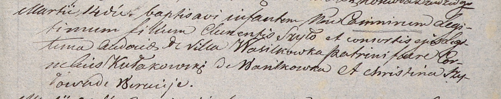
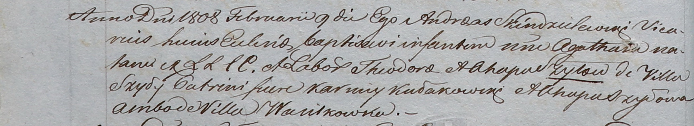

**Кулаковский Корнелий (Kułakowski Cornelius)**

14 марта 1806 г -- крестный отец Казимира, сына Клеменса и Евдокии Шил с
деревни Васильковка (НИАБ 937-4-32, лист 13, №8/1806-р).

9 февраля 1808 года -- крестный отец Агаты, дочери Хведора и Агапы Шил с
деревни Шилы (НИАБ 937-4-32, лист 17об, №5/1808-р).

**НИАБ 937-4-32:** Лист 13. **Метрическая запись №8/1806-р.**

Дедиловичский костел Наисвятейшего Сердца Иисуса. 14 марта 1806 года.
Метрическая запись о крещении.

Szyło Casimir -- сын родителей с деревни Васильковка.

Szyło Clementi -- отец.

Szyłowa Audocia -- мать.

Kułakowski Cornelius -- крестный отец, с деревни Васильковка.

Szyłowa Christina -- крестная мать, с деревни Веретей.

Linhart Hiacinthus -- ксёндз.

**НИАБ 937-4-32:** Лист 17об. **Метрическая запись №5/1808-р.**

Дедиловичский костел Наисвятейшего Сердца Иисуса. 9 февраля 1808 года.
Метрическая запись о крещении.

Szyłowna Agatha -- дочь крестьян с деревни Шилы.

Szyło Theodor -- отец.

Szyłowa Ahapa -- мать.

Kułakowski Karniey -- крестный отец, с деревни Васильковка.

Szyłowa Ahapa -- крестная мать, с деревни Васильковка.

Scindzelewski Andreas -- ксёндз, викарий Дедиловичский.
