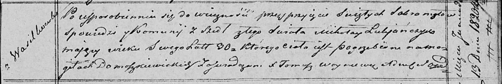

**Лукьянчик Миколай (Łukjanczyk Mikołay)**

13 января 1820 г -- отпевание, умер в возрасте 30 лет (родился около
1790 г) (НИАБ 136-13-919, лист 33, №1/1820-у (ориг)).

**НИАБ 136-13-919:** Лист 33. **Метрическая запись №1/1820-у (ориг).**

Осовская униатская церковь. 13 января 1820 года. Метрическая запись об
отпевании.

Łukjanczyk Mikołay -- умерший, 30 лет, с деревни Васильковка, похоронен
на кладбище деревни Домашковичи.

Woyniewicz Tomasz -- ксёндз.
