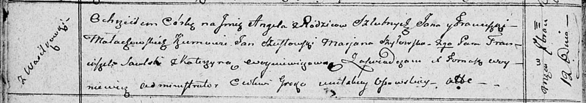

**Малаховская Ангеля Янова (Małahowska Angela)**

12 сентября 1810 г -- крещение (НИАБ 136-13-894, лист 78об, №37/1810-р
(ориг)).

**НИАБ 136-13-894:** Лист 78об. **Метрическая запись №37/1810-р
(ориг).**

Осовская Покровская церковь. 12 сентября 1810 года. Метрическая запись о
крещении.

Małachowska Angela -- дочь родителей с деревни Васильковка.

Małachowski Jan -- отец.

Małachowska Franciszka -- мать.

Szustowski Jan -- кум.

Szyłowska Marjana -- кума.

Saulski Franciszek -- кум.

Woyniewiczowa Katerzyna -- кума.

Woyniewicz Tomasz -- ксёндз.
