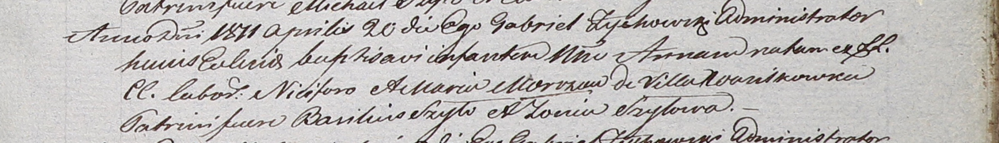

**Мороз Мария (Morozowa Maria)**

20 апреля 1811 г -- крещение дочери Анны (НИАБ 937-4-32, лист 23,
№6/1811-р).

**НИАБ 937-4-32:** Лист 23. **Метрическая запись №6/1811-р.**

Дедиловичский костел Наисвятейшего Сердца Иисуса. 20 апреля 1811 года.
Метрическая запись о крещении.

Morozowa Anna -- дочь крестьян с деревни Васильковка.

Moroz Nicifor -- отец.

Morozowa Maria -- мать.

Szyło Basilius -- крестный отец.

Szyłowa Zovia -- крестная мать.

Zychowski Gabriel -- ксёндз.
