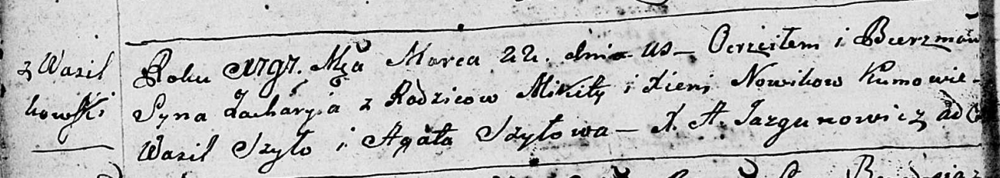

**Новик Захары Микитов (Nowik Zachary)**

22 марта 1797 г -- крещение (НИАБ 136-13-894, лист 32об, №17/1797-р
(ориг)), (РГИА 823-2-18, лист 259, №15/1797-р (коп)).

**НИАБ 136-13-894:** Лист 32об. **Метрическая запись №17/1797-р
(ориг).**

Дедиловичская Покровская церковь. 22 марта 1797 года. Метрическая запись
о крещении.

Nowik Zachary -- сын родителей с деревни Васильковка.

Nowik Mikita -- отец.

Nowikowa Xienia -- мать.

Szyło Wasil - кум.

Szyłowa Agata - кума.

Jazgunowicz Antoni -- ксёндз.

**РГИА 823-2-18:** Лист 259. **Метрическая запись №15/1797-р (коп).**

Дедиловичская Покровская церковь. 22 марта 1797 года. Метрическая запись
о крещении.

Nowik Zachary -- сын родителей с деревни Васильковка.

Nowik Mikita -- отец.

Nowikowa Xienia -- мать.

Szyło Wasil -- кум.

Szyłowa Agata -- кума.

Jazgunowicz Antoni -- ксёндз.
